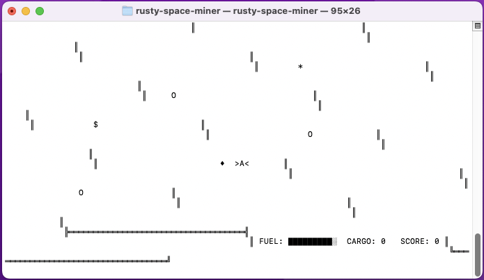

# Rusty Space Miner

**Rusty Space Miner** is a simple terminal-based real-time game written in Rust, where you pilot a mining ship through asteroid fields, collect resources, upgrade your ship, and try to survive as long as possible. This project is born from me wanting to learn the basics of Rust, including async programming, terminal I/O, and game architecture.

## Demo



## Features

- Real-time gameplay in the terminal using `WASD` controls
- Dodge asteroids and mine resources to refuel and upgrade your ship
- Progression system with ship upgrades and resource management *(not yet implemented)*
- File saving/loading for high scores *(not yet implemented)*
- Demonstrates Rust concepts: async I/O, pattern matching, error handling, and concurrency
- Simple, expandable codebase for learning and experimentation

## Getting Started

To get started with Rusty Space Miner, follow these steps:

1. **Clone the repository:**
   ```
   git clone https://github.com/Xanth3/rusty-space-miner.git
   cd rusty-space-miner
   ```

2. **Build the project:**
   Ensure you have Rust and Cargo installed. You can build the project using:
   ```
   cargo build
   ```

3. **Run the application:**
   After building, you can run the application with:
   ```
   cargo run
   ```

## Usage

- Use `WASD` to move your ship
- Press `SPACE` to mine resources
- Avoid asteroids and keep your fuel topped up
- Visit space stations to upgrade your ship

## License

This project is licensed under the MIT License. See the LICENSE file for details.